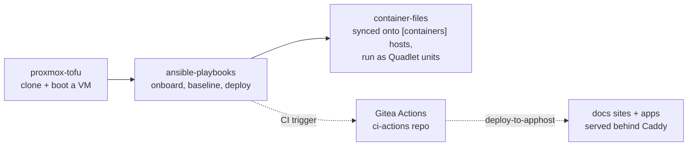

# homebase

`homebase` is the parent of a small family of repos that together run a
self-hosted homelab: Proxmox hosts, VM lifecycle, fleet configuration,
containerized services, and the Gitea CI/CD that ties it all together.
This site is the map — architecture, environments, and how the pieces
hand off to each other. Each repo below carries its own docs site for
the detail that's actually specific to it.

## The repos

| Repo | Owns | Docs |
|---|---|---|
| [`proxmox-tofu`](https://gitea.dangerzone.internal/keyton/proxmox-tofu) | VM lifecycle — cloning a VM from a golden template, sizing it, networking, cloud-init | [docs](https://docs.apps.testzone.internal/proxmox-tofu/) |
| [`ansible-playbooks`](https://gitea.dangerzone.internal/keyton/ansible-playbooks) | Everything else about a host: onboarding, baseline config, updates, secrets, the Ansible side of deploying containers | [docs](https://docs.apps.testzone.internal/ansible-playbooks/) |
| [`container-files`](https://gitea.dangerzone.internal/keyton/container-files) | Podman Quadlet unit definitions for every containerized service — no deploy logic of its own | [docs](https://docs.apps.testzone.internal/container-files/) |

`homebase` itself holds nothing operational — no inventory, no state,
no service config. It's the docs hub for the family — see
[Layout of this repo](#layout-of-this-repo) below for what actually
lives here.

## The pipeline



1. **`proxmox-tofu`** clones a VM from a golden template and boots it —
   the supported default for both environments now (a legacy
   Ansible-native path still exists as a fallback).
2. **`ansible-playbooks`** takes it from there: management network,
   baseline packages/accounts, logging, and — for hosts in the
   `[containers]` group — syncing and running `container-files` as
   systemd Quadlet units via `roles/containerapps`.
3. **`container-files`** has no deploy logic of its own; it's the
   superset of service definitions every `[containers]` host draws its
   subset from.
4. Every app repo (including each docs site) ships itself via **Gitea
   Actions**, using the shared `ci-actions` repo's `deploy-to-apphost`
   action — see [ci-cd.md](ci-cd.md).

## Environments

Two environments exist end to end — Proxmox pool, Ansible inventory,
and Tofu workspace all use the same two names:

- **`testzone`** — dev/staging
- **`dangerzone`** — prod

There's no default; every play/apply is explicit about which one it
targets. See `ansible-playbooks/docs/VAULT.md` and `proxmox-tofu`'s
README for exactly how each tool selects an environment.

## Layout of this repo

```
docs/            this site's Markdown source
zensical.toml    site config (nav, theme)
Containerfile    builds docs/ into a Caddy image (zensical build -> site/)
.gitea/workflows/deploy.yml   builds + ships this site on push to main
```

Read next: [Architecture](architecture.md) for how the fleet's
networking and hosts fit together, [CI/CD](ci-cd.md) for how every repo
here — including this one — gets from a push to a running container,
and [Observability](observability.md) for the monitoring/logging stack.
